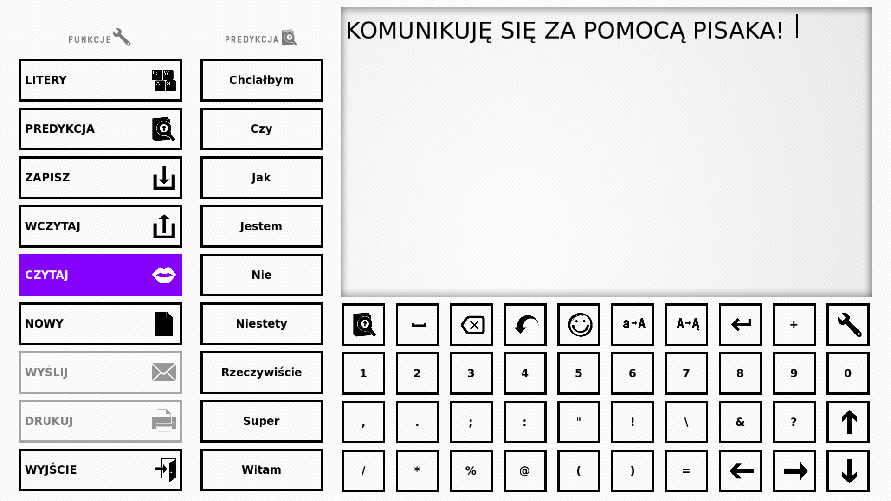
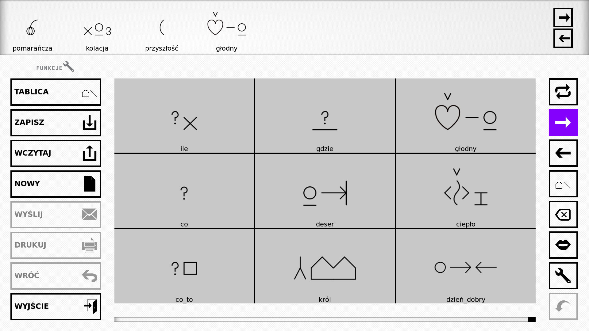
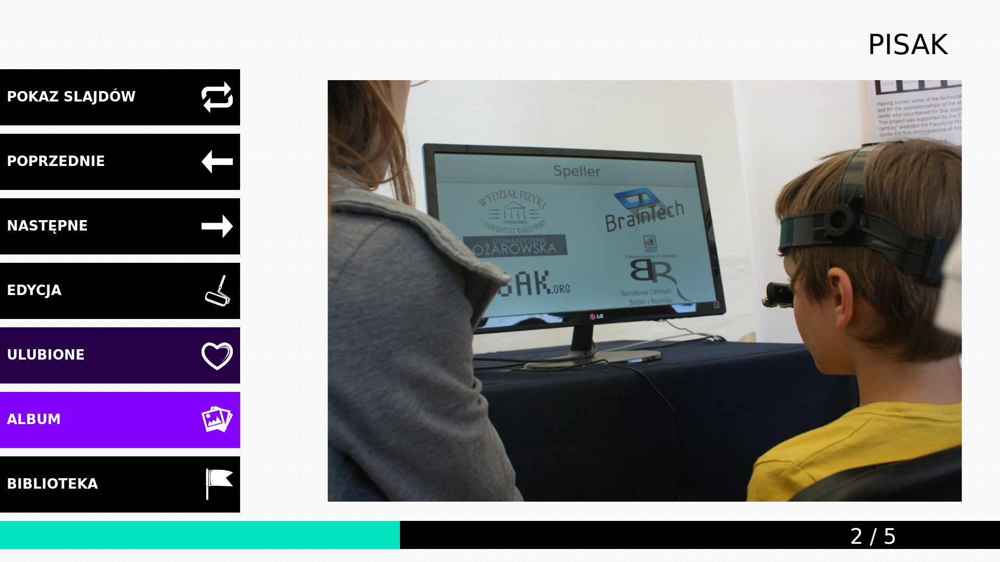
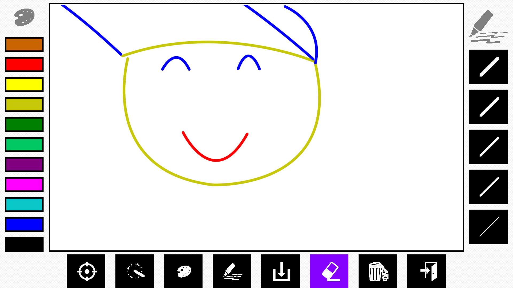
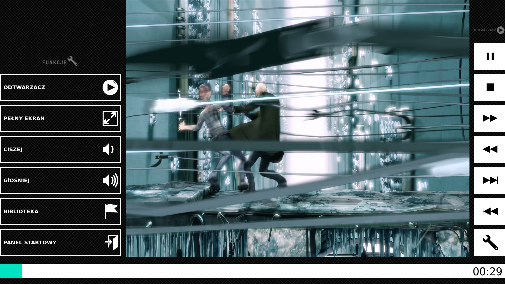
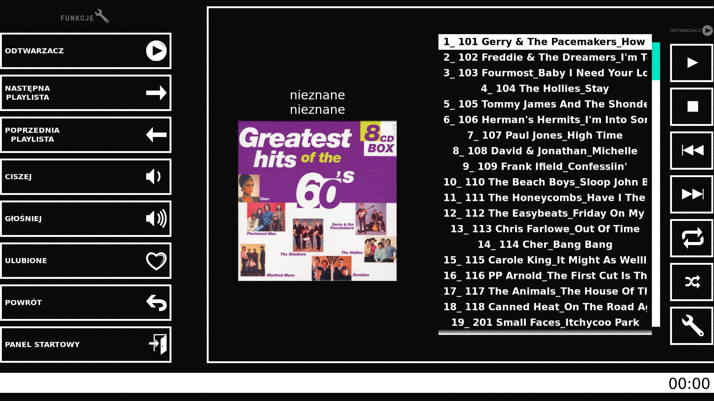
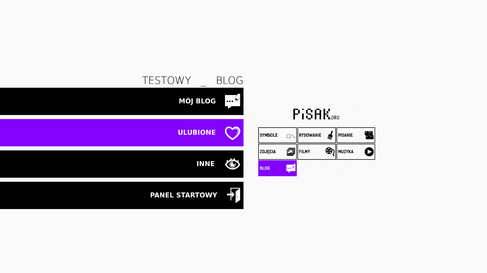
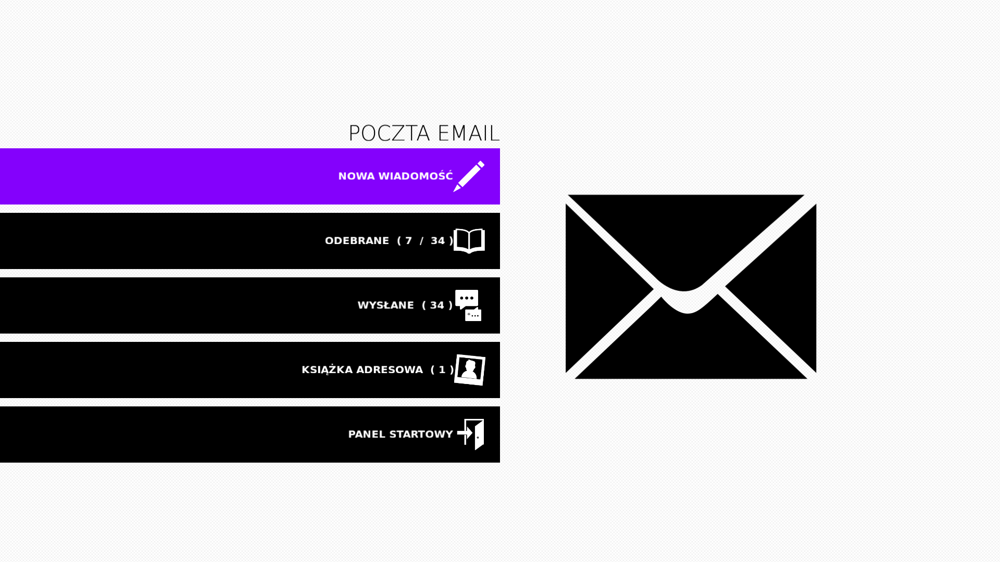

Speller - :doc:`pisak.speller`
------------------------------
Allows the user to write their own text with prediction at hand. After it can be read out loud, saved, printed or sent via email.

Symboler - :doc:`pisak.symboler`
--------------------------------
Same as with `Speller` but writing happens via symbols (Bliss, Sclera etc.).

	   
Viewer - :doc:`pisak.viewer`
----------------------------
App for browsing and editing pictures.

	
Paint - :doc:`pisak.paint`
--------------------------
Paint your own drawing.

	   
Movie - :doc:`pisak.movie`
--------------------------
Application that allows to watch movies.

	   
Audio - :doc:`pisak.audio`
--------------------------
Application that allows to listen to music.

	   
Blog - :doc:`pisak.blog`
--------------------------
Application that allows to publish a blog and view other blogs.

	   
Email - :doc:`pisak.email`
--------------------------
Application that allows to write and receive emails.

	
