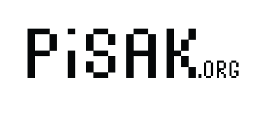

.. PISAK documentation master file, created by
   sphinx-quickstart on Wed Apr 30 16:23:23 2014.
   You can adapt this file completely to your liking, but it should at least
   contain the root `toctree` directive.

PISAK - whoami
==============
.. toctree::
   :maxdepth: 2
   
   whatisit

Guides and HOW-TO's
===================
.. toctree::
   :maxdepth: 2

   guides
   howTOs

Modules
=======
.. toctree::
   :maxdepth: 2

   modules

JSON creation
=============
.. toctree::

   json_creation

Authors
=======
.. toctree::

   authors

Indices and tables
==================

* :ref:`genindex`
* :ref:`modindex`
* :ref:`search`

