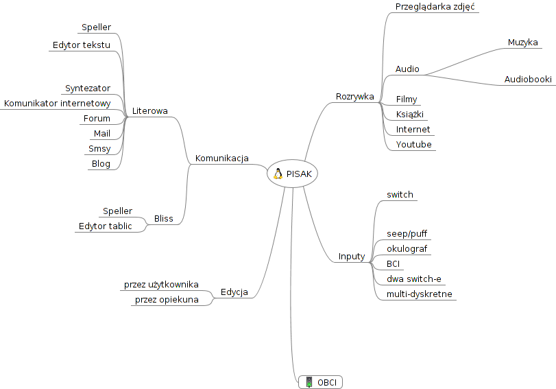

Introduction
------------
PISAK is a platform for people with severe impairments of muscle control allowing them to operate basic computer functionalities through singular (0-1) input.

Applications
------------
.. toctree::
   :maxdepth: 1

   applications

Architecture
------------

As the group of disabled people is very heterogenous PISAK is made as customisable as possible, we try to utilise this rule on macroscale(you are able to choose which applications to launch through the config) and microscale(every application is configurable through the config files, corresponding jsons and a css file).

Each application can be run separately by invoking/running it's `app.py` (see :doc:`app_dev_guide`).

An application is build through stacking together different `widgets` in a json file by their `gtype_name's` and defining their `properties`.

`Properties` defined through a json file have the highest priority, if you do not need to have a custom one for each object you can specify it through a config file for all widgets with a certain `gtype_name`.

Concept - Code translation
--------------------------

Below you may read how different concepts lead to particular design of PISAK.

Scanning and binary choice
**************************

binary choice access -> :class:`pisak.scanning.Group`

For many users with extremely impaired motor skills the only way to operate a computer program on their own is through a binary choice. Meaning that the only thing the user can do is to give one signal, a "click"(different users use different inputs - air blowing, head clicking, elbow clicking, blinking). Such user is not capable of picking one of the various elements being displayed on a screen by himself. Instead, the elements, or groups of elements, have to be presented to him one by one(scanning) and he or she waits to choose one of them. The goal was to develop an interface that works according to the above pattern, offers the best efficiency, freedom of choice and usage. The important thing is to provide a user with an equal access to all the functional elements he can see on the screen and with an ability to achieve the same results, as other people do, operating some standard interfaces.
The scanning group is a container that can contain many scannable elements or further scanning groups nested to an arbitrary level. Application's functional pieces can be arranged into scanning blocks in any order, according to any arbitrary design. Every group has its scanning cycle that defines the scanning properties and performs the proper scanning proccess. The basic rule of the scanning proccess is that consecutive elements are highlighted and when it comes to the element that user wants to pick, he activates an input device being used. For a scanning process one can define various properties that correspond to the following ideas:

- interval - period of time the highlight hold on to the current element before moving to the next one; different intervals suits different users, one prefers to examine all the avalaible elements right at a beginning and then just waits for the scanning proccess to reach the desired one, another, maybe when the scanning order is unclear, inspects each element just when it is highlighted and therefore has to have time for deciding on the correct one;
- highlight - if the the whole group whose elements are currently scanned should be highlighted with another color; it can help to distinct the whole group of elements that will be avalaible within the current scanning cycle;
- starting lag - period of time after selection of one of the scanning subgroups and before starting of its scanning cycle; one can comfortably watch the options that will be avalaible within the forthcoming cycle and properly prepare to make a call;
- sounds - sounds played at every scanning cycle step or after user selection; they help when user is not looking at the screen or has problem with distinction of scanned elements or when he picks something by accident and is not really aware of that fact, they also give such a rythm useful to some users and help to count the elements; 
- strategy - order in which the elements of a group will be scanned; enables an application designer to introduce different scanning patterns, i.e row or column pattern, appropriate for different users and different graphical layouts;
- number of max cycles - number of cycles of scanning the same group with no user activity after which it should exit the group; it depends how fast a user is in making decisions;
- where to go back - which group should be scanned after exiting the current one without any user action; sometimes it should always go back to the most top group, no matter from where, to keep things in order, sometimes it should go back to some particular group of a higher importance and sometimes it should go back to different groups from different places, according to some specific design;
- selector - input device that the group is reactive to(the implementation is very easy so if you are adapting PISAK for a user that already has an input that she/he uses then it is better to implement it than using one done by us - here is a :ref:`HOWTO-implement-input` do it from PISAK's side)
    
  - mouse-switch - where a mouse left-click is taken as input and the cursor is hidden
  - switch - as above but the cursor is not hidden
  - keyboard - spacebar is taken as input

Dictionary
----------
* :doc:`widgets` - building blocks of an app
* jsons - where you define how an app looks like, which widgets it uses,how are the placed and which signals they use
* app.py - python description of relations between views and container of App descriptor (see :doc:`app_dev_guide`)
* configs - config files where section names are `gtype_name's`, keys are `property` names
* :doc:`handlers` - handlers for specified signals, invoking functions
* properties - characteristics of an object(width, height, source etc.)
